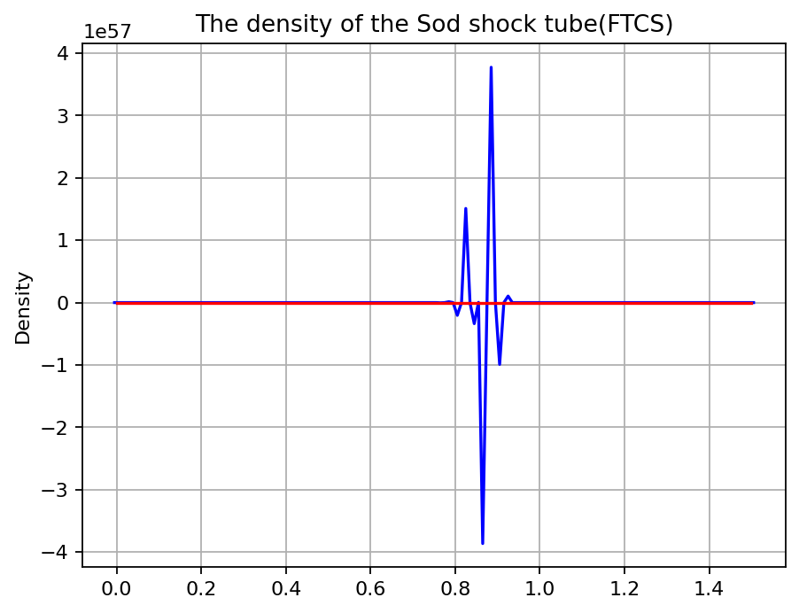
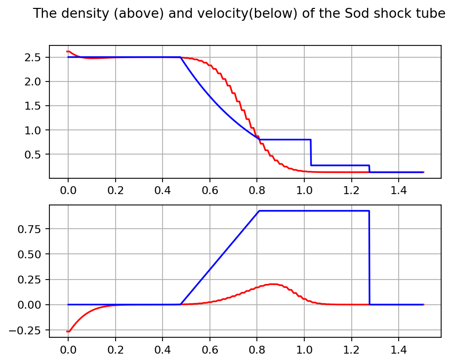
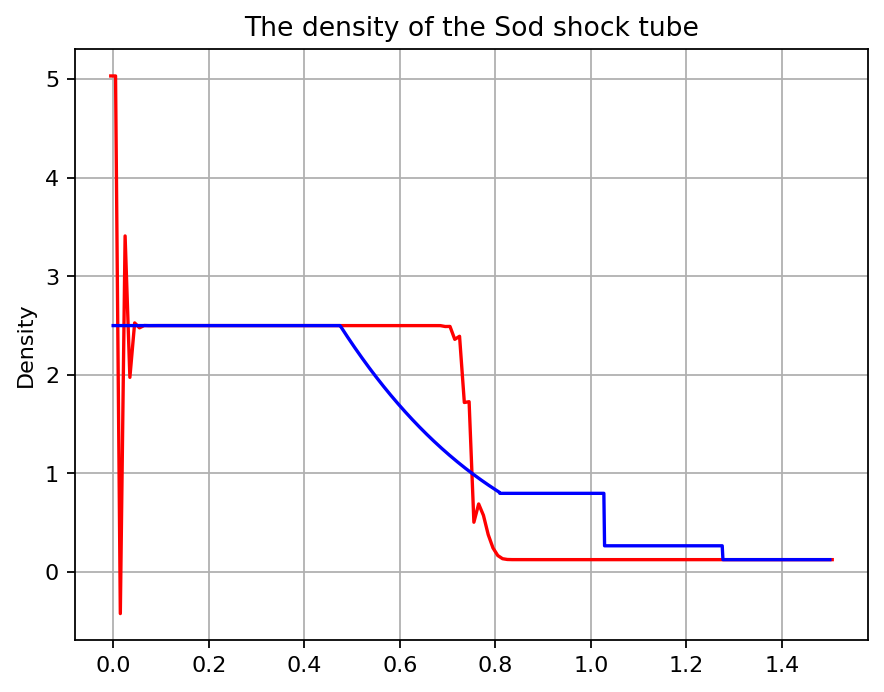
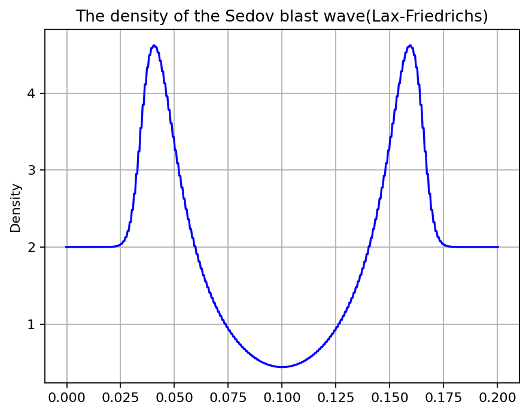
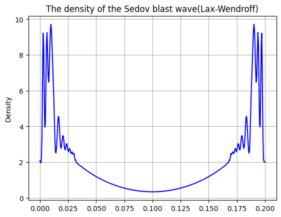

# Numerical Hydrodynamics: Shock Tubes and Blast Waves

An undergraduate scientific computing project exploring the one-dimensional compressible Euler equations with Python. The notebook implements three explicit numerical schemes and investigates their behaviour in a Sod-type shock-tube problem and a localised blast-wave experiment.

The project connects conservation laws, numerical discretisation and numerical experiments.

**Author:** Yuhan Chen  
**Tools:** Python, NumPy, Matplotlib and Jupyter

## Project scope

- Represent a compressible gas using density, momentum density and total energy density.
- Construct physical and interface fluxes for explicit time stepping.
- Implement FTCS, Lax-Friedrichs and a two-step Lax-Wendroff formulation.
- Plot density and velocity profiles and compare the shock-tube calculation with supplied reference data.
- Explore numerical smoothing, oscillations and the importance of boundary conditions and time-step selection.


## Physical model

The calculation uses the one-dimensional Cartesian Euler equations for an ideal gas:

$$
\frac{\partial\mathbf{q}}{\partial t}
+\frac{\partial\mathbf{F}(\mathbf{q})}{\partial x}=0,
$$

$$
\mathbf{q}=\begin{pmatrix}\rho\ \\ \rho u \\ \E\end{pmatrix},
\qquad
\mathbf{F}(\mathbf{q})=
\begin{pmatrix}\rho u\\ \rho u^2+p \\ u(E+p)\end{pmatrix},
\qquad
p=(\gamma-1)\left(E-\frac{\rho u^2}{2}\right).
$$

Here, $\rho$ is density, $u$ is velocity, $p$ is pressure, $E$ is total energy per unit volume, and $\gamma$ is the ratio of specific heats. The quantities are used in the numerical units of the original exercise; no physical unit system is specified.

For background on these equations, see the [Clawpack Riemann book: Euler equations of gas dynamics](https://www.clawpack.org/riemann_book/html/Euler.html).

## Experiments and methods

| Experiment | Initial conditions | Grid and nominal evolution | Methods used in calculation cells |
| --- | --- | --- | --- |
| Sod-type shock tube | Left: density 2.5, pressure 1.5, velocity 0. Right: density 0.125, pressure 0.1, velocity 0. Discontinuity at x = 0.75; gamma = 1.4. | 150 physical cells plus two ghost cells; dx = 0.01; dt = 0.0003; 100 steps to t = 0.03. | FTCS, Lax-Friedrichs, Lax-Wendroff |
| Localised blast wave | Uniform density 2 and zero velocity. Four central cells have total energy density 60; the surrounding gas has pressure 0.00002. Gamma = 5/3. | 400 physical cells plus two ghost cells; dx = 0.0005; dt = 0.0001; 500 steps to t = 0.05. | Lax-Friedrichs, Lax-Wendroff |

The blast-wave section is labelled "Sedov blast wave" in the notebook. It is a one-dimensional localised blast-wave experiment, without a claim of validation against the spherical Sedov-Taylor solution.


## Files and preparation

Keep `Numerical_part1_Yuhan Chen(s4431375).ipynb`, `sod_exact_003.txt` and `sod_exact_03.txt` in the same directory. No renaming is needed.


## Running the notebook

From the directory containing the files, create an environment and install the dependencies:

```bash
python -m venv .venv
source .venv/bin/activate
python -m pip install numpy matplotlib jupyterlab
python -m jupyter lab
```

On Windows, use `.venv\Scripts\activate` for the activation step. Open `Numerical_part1_Yuhan Chen(s4431375).ipynb` in JupyterLab. In VS Code, select the Python environment containing NumPy and Matplotlib as the notebook kernel.

**Run each numerical method from fresh initial conditions.** The calculation cells modify the same state array in place. Clearing plot outputs does not reset that array, and running all method cells consecutively does not produce independent comparisons.

For a shock-tube experiment:

1. Restart the kernel.
2. Run **Imports**, **Grid setup**, **Initial conditions**, **Comparison settings** and **Define hydro functions**.
3. Run only one calculation cell under **Calculating the evolution: Sod shock tube**.
4. Repeat from step 1 for another method.

For a blast-wave experiment:

1. Restart the kernel and run **Imports**.
2. Run **Sedov blast wave: grid**, **Sedov blast wave: initial conditions** and the following hydrodynamics-function definitions.
3. Run one blast-wave calculation cell.
4. Reinitialise the calculation before changing methods.

The two problem sections redefine functions with hard-coded grid sizes. Rerun the appropriate definitions whenever switching problems.

## Known limitations


1. **Reference-time mismatch.** Each fresh shock-tube run advances to t = 0.03, but the plotting cells select `q_exact_03`. Based on the filenames, `q_exact_003` is the intended comparator. Confirm the reference timestamps and use the matching table in every overlay before interpreting agreement.
2. **Boundary indexing.** `range(150)` and `range(400)` omit the rightmost physical cell, making the corresponding final-cell update branches unreachable. The first physical cell also lacks the exterior boundary flux in its update. Copying ghost-cell values does not repair these omissions.
3. **Time-step control.** There is no adaptive time step or positivity check. For the blast initial state, the Courant number `(dt/dx) * max(abs(u) + sqrt(gamma*p/rho))` is approximately 1.15. Time-step suitability must be reassessed as the solution evolves.
4. **Shared mutable arrays.** Flux routines depend on global work arrays, and calculation cells reuse the evolving state. This makes execution order significant.
5. **Unphysical results.** Inspection runs from fresh initial conditions produced negative densities for the shock-tube FTCS and Lax-Wendroff cells, and overflow/non-finite values for the blast-wave Lax-Wendroff cell. These observations concern this implementation and its selected parameters; they do not isolate the numerical method from the boundary and stability issues above.

## Numerical_part1: notebook cells and result pictures

The following reproduces every Markdown and code cell from [the original notebook](Numerical_part1_Yuhan%20Chen%28s4431375%29.ipynb) in its original order. Cell numbers count both Markdown and code cells.

The notebook contains no saved outputs. The five result pictures below were generated with Python, NumPy and Matplotlib by running each calculation separately from fresh initial conditions, as described above. The source code, plot labels and reference-data choices are unchanged. Clearing outputs alone does not reset the state; the setup cells were rerun for each method. Numerical warnings and invalid states are noted beneath the corresponding pictures. The original notebook commentary is reproduced verbatim and should be read alongside these notes and the known limitations above.

<!-- Notebook cell 1: markdown -->

#### Please note that it is better to run the imports, gird setup, initial conditions, comparing settings, define of hydro functions first and then run the calculate cells using FTCS, Lax-Friedrichs, Lax-Wendroff seperately. After running one such calcualtion cell, it is better to clear the output and run another calculation cell.

<!-- Notebook cell 2: markdown -->

# Imports

<!-- Notebook cell 3: code -->

```python
import numpy as np
import matplotlib.pyplot as plt
```

<!-- Notebook cell 4: markdown -->

# Grid setup

<!-- Notebook cell 5: code -->

```python
# Define your grid here. E.g. the number of (ghost) cells, the boxsize, ...
gamma = 1.4 # The value of adiabatic index
deltat = 0.0003
deltax = 0.01
q = np.empty([3, 152], dtype = float)# initialize the matrix to store the value of each cells
```

<!-- Notebook cell 6: markdown -->

# Initial conditions

<!-- Notebook cell 7: code -->

```python
# Define your initial conditions here.
# Initialise your state vector q (containing density, momentum and energy), e.g. as zeros with shape (3, N_CELLS)
# Use a few variables to set different ranges of the grid to the different initial conditions
for i in range(75):
    q[0,i+1] = 2.5
    q[1,i+1] = 0
    q[2,i+1] = 1.5/(gamma-1)
    q[0,150-i] = 0.125
    q[1,150-i] = 0
    q[2,150-i] = 0.1/(gamma-1)

# The setup of ghost cells to guarantee zero gradient with the adjacent cells
for i in range(3):
    q[i,0] = q[i,1]
    q[i,151] = q[i,150]
```

<!-- Notebook cell 8: markdown -->

# Comparison settings

<!-- Notebook cell 9: code -->

```python
# Load analytical solution:
# x, rho, P, u, e
q_exact_003 = np.genfromtxt('./sod_exact_003.txt',skip_header=1,delimiter=',')
q_exact_03 = np.genfromtxt('./sod_exact_03.txt',skip_header=1,delimiter=',')
```

<!-- Notebook cell 10: markdown -->

# Define hydro functions

<!-- Notebook cell 11: code -->

```python
# Define the functions you will need here.

def flux_function(q, gamma):
    """ Define a function to determine the fluxfunction f(q) for a state vector q.
    Remember that q should contain three different quantities. """
    # calculate the flux given a state vector q
    for i in range(151):
        if i>0 :
        # define temporary variable for simplicity
            q1 = q[0,i]
            q2 = q[1,i]
            q3 = q[2,i]
            f[0,i-1] = q2
            f[1,i-1] = ((q2*q2)/q1) + (gamma-1)*(q3-0.5*q2*q2/q1)
            f[2,i-1] = (q3+(gamma-1)*(q3-0.5*q2*q2/q1))*(q2/q1)
    # return the flux vector
    return f

def flux_function_interface(Q, gamma):
    """ Define a function to determine the fluxfunction f(Q) for a interface state Q."""

    # calculate the flux given a state vector q
    for i in range(149):
        # define temporary variable for simplicity
            q1 = Q[0,i]
            q2 = Q[1,i]
            q3 = Q[2,i]
            f[0,i] = q2
            f[1,i] = ((q2*q2)/q1) + (gamma-1)*(q3-0.5*q2*q2/q1)
            f[2,i] = (q3+(gamma-1)*(q3-0.5*q2*q2/q1))*(q2/q1)
    # return the flux vector
    return f

def update_q_with_fluxes(q, f, F, gamma, deltat, deltax):
    """ Define a function that updates the state vector q with the appropriate fluxes. """
    # calculate something
    for i in range(150):
        for j in range(3):
            if ((i>1) and (i<150)):
                q[j,i] = q[j,i] - (deltat/deltax)*(F[j,i-1]-F[j,i-2])
            elif i == 1:
                q[j,i] = q[j,i] - (deltat/deltax)*F[j,0]
            elif i == 150:
                q[j,i] = q[j,i] + (deltat/deltax)*F[j,148]
            else: # first give the unchanged value to the ghost cells, they will be given value after this loop
                q[j,i] = q[j,i]

    # give value to the ghost cell after the flux have been updated
    for j in range(3):
        q[j,0] = q[j,1]
        q[j,151] = q[j,150]


    return q
    # return something

def calculate_flux_FTCS(f, gamma):
    """ Define a function that calculates the fluxes for a state vector q using the FTCS method. """
    # calculate the flux at each interface of the cells
    for i in range(149):
        for j in range(3):
            F[j,i] = 0.5*(f[j,i]+f[j,i+1])
    # return result of the calculation of the interface flux using FTCS
    return F

def calculate_flux_Lax_Friedrichs(f, gamma, deltax, deltat, q):
    """ Define a function that calculates the fluxes for a state vector q using the Lax-Friedrichs method. """
    #calculate the flux at each interface of the cells
    F = np.empty([3, 149], dtype = float)
    for i in range(149):
        for j in range(3):
            F[j,i] = 0.5*(f[j,i]+f[j,i+1]) - 0.5*(deltax/deltat)*(q[j,i+2]-q[j,i+1])
    # return result of the calculatetion of the interface flux using Lax-Friedrichs
    return F

def calculate_flux_Lax_Wendroff(f, gamma, deltax, deltat, q):
    #calculate the flux at each interface of the cells
    Q = np.empty([3, 149], dtype = float)
    for i in range(149):
        for j in range(3):
            Q[j,i] = 0.5*(q[j,i+2]+q[j,i+1])-0.5*(deltat/deltax)*(f[j,i+1]-f[j,i])
    F = flux_function_interface(Q,gamma)
    return F
# Once you have finished and tested the calculate_flux_FTCS-function, make a new function where you
# update it to implement the Lax-Friedrich method. After that make another function to implement
# the Lax-Wendroff method, so that you can always compare to the old functions.

```

<!-- Notebook cell 12: markdown -->

## Calculating the evolution: Sod shock tube

<!-- Notebook cell 13: code -->

```python
# Place the actual calculations here. Make a loop (e.g. a while-loop) and update (a copy of) the state vector each
# iteration. Save it, and check for boundary conditions.
# Repeat for the different methods you will implement. Remember to make separate blocks, headlines, comments...
gamma = 1.4 # The value of adiabatic index
deltat = 0.0003
deltax = 0.01
f = np.empty([3, 150], dtype = float)
F = np.empty([3, 149], dtype = float)

for k in range(100): # advance the solution 100 times from t=0 to t= 0.03
    f = flux_function(q, gamma)  # calculate the flux using the flux function
    F = calculate_flux_FTCS(f, gamma) # calculate the flux at the interface of two cells
    q = update_q_with_fluxes(q, f, F, gamma, deltat, deltax) # calculate the updated state matrix

# make a plot of the density of a function of x
x = np.empty([152, 1], dtype = float) # make an array to store the x axis
#setup of the grid
for i in range(152):
    x[i,0] = -0.005 + 0.01*i
y =  q[0,:]
plt.plot(x, y, color='blue' ) # Function plot()
plt.title("The density of the Sod shock tube(FTCS)")                             # A title on top
plt.ylabel("Density") # A label along Y
plt.grid()            # Overlay grid lines
plt.plot(q_exact_03[:,0], q_exact_03[:,1] , color='red')
plt.show()
```



The computed state contains negative densities, so this result is not a physically valid solution.

<!-- Notebook cell 14: code -->

```python
# The following code intends to calculate the flux with the Lax-Friedrichs method and make a plot to compare
gamma = 1.4 # The value of adiabatic index
deltat = 0.0003
deltax = 0.01
f = np.empty([3, 150], dtype = float)
F = np.empty([3, 149], dtype = float)


for k in range(100): # advance the solution 100 times from t=0 to t= 0.03
    f = flux_function(q, gamma)  # calculate the flux using the flux function
    F = calculate_flux_Lax_Friedrichs(f, gamma, deltax, deltat, q) # calculate the flux at the interface of two cells
    q = update_q_with_fluxes(q, f, F, gamma, deltat, deltax) # calculate the updated state matrix

# make a plot of the density of a function of x
x = np.empty([152, 1], dtype = float) # make an array to store the x axis
#setup of the grid
for i in range(152):
    x[i,0] = -0.005 + 0.01*i
y1 =  q[0,:] #The density
y2 =  q[1,:]/q[0,:]


# Make the plots of density and velocity
fig, axs = plt.subplots(2)
fig.suptitle('The density (above) and velocity(below) of the Sod shock tube')
axs[0].plot(x, y1, color='red' )
axs[0].plot(q_exact_03[:,0], q_exact_03[:,1] , color='blue')
axs[0].grid()
axs[1].plot(x, y2, color='red' )
axs[1].plot(q_exact_03[:,0], q_exact_03[:,3] , color='blue')
axs[1].grid()
```



<!-- Notebook cell 15: markdown -->

#### The problem of Lax-Friedrichs is it severely smooths out the solution. And in the cell below, the density is obtained using the Lax-Wendroff method. The problem is the solution ocsillates strongly at the right end of the x coordinate, which makes it harder to have a good look at the whole figure.

<!-- Notebook cell 16: code -->

```python
# The following code intends to calculate the flux with the Lax-Wendroff method and make a plot to compare
gamma = 1.4 # The value of adiabatic index
deltat = 0.0003
deltax = 0.01
f = np.empty([3, 150], dtype = float)
F = np.empty([3, 149], dtype = float)


for k in range(100): # advance the solution 100 times from t=0 to t= 0.03
    f = flux_function(q, gamma)  # calculate the flux using the flux function
    F = calculate_flux_Lax_Wendroff(f, gamma, deltax, deltat, q) # calculate the flux at the interface of two cells
    q = update_q_with_fluxes(q, f, F, gamma, deltat, deltax) # calculate the updated state matrix


# make a plot of the density of a function of x
x = np.empty([152, 1], dtype = float) # make an array to store the x axis
#setup of the grid
for i in range(152):
    x[i,0] = -0.005 + 0.01*i
y =  q[0,:]

plt.plot(x, y, color='red' ) # Function plot()
plt.title("The density of the Sod shock tube")                             # A title on top
plt.ylabel("Density")                           # A label along Y
plt.grid()                                          # Overlay grid lines
plt.plot(q_exact_03[:,0], q_exact_03[:,1] , color='blue')
plt.show()
```



The computed state contains negative densities, so this result is not a physically valid solution.

<!-- Notebook cell 17: markdown -->

# Sedov blast wave: grid
### Please note that it is better to clear output to run the cells below.

<!-- Notebook cell 18: code -->

```python
# Reset the grid for the second test you will run. The functions will remain the same.
x = np.empty([402, 1], dtype = float) # make an array to store the x axis
#setup of the grid
for i in range(402):
    x[i,0] = -0.00025 + 0.0005*i
```

<!-- Notebook cell 19: markdown -->

# Sedov blast wave: initial conditions

<!-- Notebook cell 20: code -->

```python
# Reset you intial conditions.
q = np.empty([3, 402], dtype = float)# initialize the matrix to store the value of each cells
gamma = 5/3#The value of gamma

# The following is used to setup the initial condition
for i in range(402):
    if ((i==199) or (i==200) or (i ==201) or (i ==202)):
        q[0,i] = 2
        q[1,i] = 0
        q[2,i] = 60
    elif ((i>0) and (i <199)):
        q[0,i] = 2
        q[1,i] = 0
        q[2,i] = (0.00002)/(gamma-1)
    elif ((i>202) and (i<401)):
        q[0,i] = 2
        q[1,i] = 0
        q[2,i] = (0.00002)/(gamma-1)

# assign value to the ghost cells after the values in other cells are given
for j in range(3):
    q[j,0] = q[j,1]
    q[j,401] = q[j,400]
```

<!-- Notebook cell 21: markdown -->

## Define hydrofunctions for Sedov blast wave (Because of different number of grids, we define the hydrofunctions again)

<!-- Notebook cell 22: code -->

```python
# Define the functions you will need here.

def flux_function(q, gamma):
    """ Define a function to determine the fluxfunction f(q) for a state vector q.
    Remember that q should contain three different quantities. """
    # calculate the flux given a state vector q
    for i in range(401):
        if i>0 :
        # define temporary variable for simplicity
            q1 = q[0,i]
            q2 = q[1,i]
            q3 = q[2,i]
            f[0,i-1] = q2
            f[1,i-1] = ((q2*q2)/q1) + (gamma-1)*(q3-0.5*q2*q2/q1)
            f[2,i-1] = (q3+(gamma-1)*(q3-0.5*q2*q2/q1))*(q2/q1)
    # return the flux vector
    return f

def flux_function_interface(Q, gamma):
    """ Define a function to determine the fluxfunction f(Q) for a interface state Q."""

    # calculate the flux given a state vector q
    for i in range(399):
        # define temporary variable for simplicity
            q1 = Q[0,i]
            q2 = Q[1,i]
            q3 = Q[2,i]
            f[0,i] = q2
            f[1,i] = ((q2*q2)/q1) + (gamma-1)*(q3-0.5*q2*q2/q1)
            f[2,i] = (q3+(gamma-1)*(q3-0.5*q2*q2/q1))*(q2/q1)
    # return the flux vector
    return f

def update_q_with_fluxes(q, f, F, gamma, deltat, deltax):
    """ Define a function that updates the state vector q with the appropriate fluxes. """
    # calculate something
    for i in range(400):
        for j in range(3):
            if ((i>1) and (i<400)):
                q[j,i] = q[j,i] - (deltat/deltax)*(F[j,i-1]-F[j,i-2])
            elif i == 1:
                q[j,i] = q[j,i] - (deltat/deltax)*F[j,0]
            elif i == 400:
                q[j,i] = q[j,i] + (deltat/deltax)*F[j,398]
            else: # first give the unchanged value to the ghost cells, they will be given value after this loop
                q[j,i] = q[j,i]

    # give value to the ghost cell after the flux have been updated
    for j in range(3):
        q[j,0] = q[j,1]
        q[j,401] = q[j,400]


    return q
    # return something

def calculate_flux_FTCS(f, gamma):
    """ Define a function that calculates the fluxes for a state vector q using the FTCS method. """
    # calculate the flux at each interface of the cells
    for i in range(399):
        for j in range(3):
            F[j,i] = 0.5*(f[j,i]+f[j,i+1])
    # return result of the calculation of the interface flux using FTCS
    return F

def calculate_flux_Lax_Friedrichs(f, gamma, deltax, deltat, q):
    """ Define a function that calculates the fluxes for a state vector q using the Lax-Friedrichs method. """
    #calculate the flux at each interface of the cells
    F = np.empty([3, 399], dtype = float)
    for i in range(399):
        for j in range(3):
            F[j,i] = 0.5*(f[j,i]+f[j,i+1]) - 0.5*(deltax/deltat)*(q[j,i+2]-q[j,i+1])
    # return result of the calculatetion of the interface flux using Lax-Friedrichs
    return F

def calculate_flux_Lax_Wendroff(f, gamma, deltax, deltat, q):
    #calculate the flux at each interface of the cells
    Q = np.empty([3, 399], dtype = float)
    for i in range(399):
        for j in range(3):
            Q[j,i] = 0.5*(q[j,i+2]+q[j,i+1])-0.5*(deltat/deltax)*(f[j,i+1]-f[j,i])
    F = flux_function_interface(Q,gamma)
    return F
# Once you have finished and tested the calculate_flux_FTCS-function, make a new function where you
# update it to implement the Lax-Friedrich method. After that make another function to implement
# the Lax-Wendroff method, so that you can always compare to the old functions.

```

<!-- Notebook cell 23: markdown -->

## Calculating the evolution: Sedov blast wave

<!-- Notebook cell 24: code -->

```python
# Place the actual calculations here. Make separate blocks for the different methods.
# Place the actual calculations here. Make a loop (e.g. a while-loop) and update (a copy of) the state vector each
# iteration. Save it, and check for boundary conditions.
# Repeat for the different methods you will implement. Remember to make separate blocks, headlines, comments...
gamma = 5/3 # The value of adiabatic index
deltat = 0.0001
deltax = 0.0005
f = np.empty([3, 400], dtype = float)
F = np.empty([3, 399], dtype = float)

for k in range(500): # advance the solution 500 times from t=0 to t= 0.05
    f = flux_function(q, gamma)  # calculate the flux using the flux function
    F = calculate_flux_Lax_Friedrichs(f, gamma, deltax, deltat, q) # calculate the flux at the interface of two cells
    q = update_q_with_fluxes(q, f, F, gamma, deltat, deltax) # calculate the updated state matrix

y =  q[0,:]
plt.plot(x, y, color='blue' ) # Function plot()
plt.title("The density of the Sedov blast wave(Lax-Friedrichs)")                             # A title on top
plt.ylabel("Density") # A label along Y
plt.grid()            # Overlay grid lines
plt.show()
```



<!-- Notebook cell 25: code -->

```python
gamma = 5/3 # The value of adiabatic index
deltat = 0.0001
deltax = 0.0005
f = np.empty([3, 400], dtype = float)
F = np.empty([3, 399], dtype = float)

for k in range(500): # advance the solution 500 times from t=0 to t= 0.05
    f = flux_function(q, gamma)  # calculate the flux using the flux function
    F = calculate_flux_Lax_Wendroff(f, gamma, deltax, deltat, q) # calculate the flux at the interface of two cells
    q = update_q_with_fluxes(q, f, F, gamma, deltat, deltax) # calculate the updated state matrix

y =  q[0,:]
plt.plot(x, y, color='blue' ) # Function plot()
plt.title("The density of the Sedov blast wave(Lax-Wendroff)")                             # A title on top
plt.ylabel("Density") # A label along Y
plt.grid()            # Overlay grid lines
plt.show()
```



Runtime warnings during this run: `invalid value encountered in scalar add`; `invalid value encountered in scalar subtract`; `overflow encountered in scalar multiply`.

The computed state contains non-finite values; the plot is reproduced as generated and does not represent a valid physical solution.

<!-- Notebook cell 26: markdown -->

### When I want to evolve this problem using Lax-Wendroff the density near the maximum oscilates strongly.
